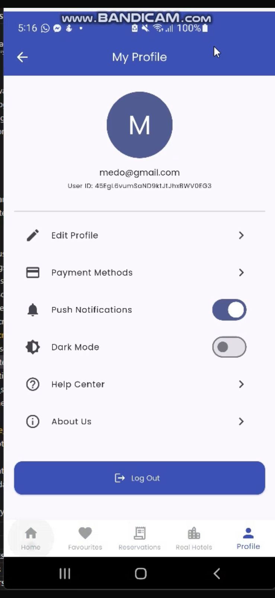
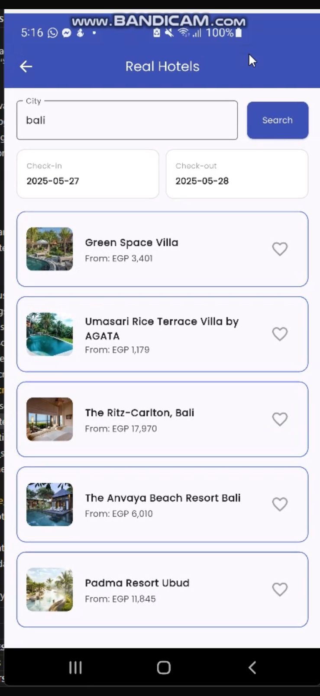
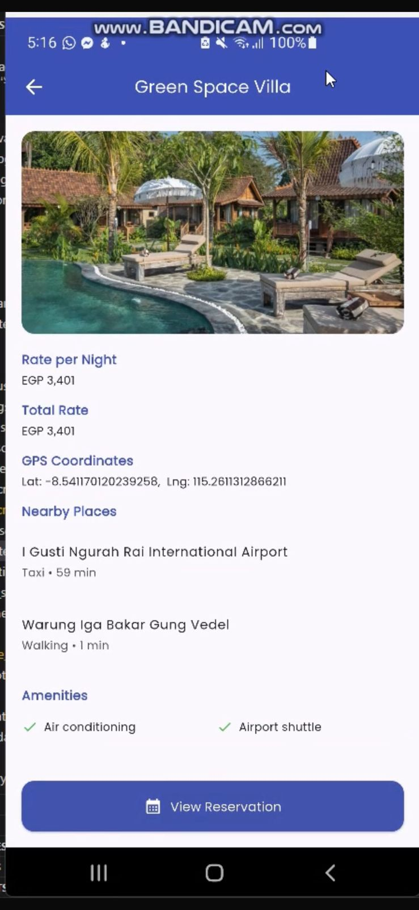

# TripStick 🏨✨

[](https://flutter.dev/) [](https://dart.dev/) [](https://firebase.google.com/)

A **cross‑platform** mobile application for **seamless**, **intuitive** worldwide hotel booking. Built with **Flutter** and **Firebase**, TripStick connects you to real‑time hotel data and gives you a personalized, streamlined reservation flow.

---

## 📸 Screenshots

<p align="center">
  
  
  
</p>

---

## 🚀 Features

* **Welcome & Onboarding**
  Friendly splash and onboarding screens to get started.
* **Secure Authentication**
  Sign up / log in with email and password via Firebase Auth.
* **Real‑time Hotel Search**
  Live API‑powered search for global hotel listings.
* **Easy Booking Flow**
  View details, select dates, reserve rooms in three taps.
* **Personalized Dashboard**
  Track and manage your reservations, favorites, and settings.
* **Dark Mode & Theming**
  Toggle between light and dark themes for your comfort.
* **Profile Management**
  Edit your profile and notification preferences.

---

## 🛠️ Tech Stack

* **Frontend:** Flutter
* **Backend:** Firebase (Authentication, Firestore Database)
* **Storage:** Firebase Storage (for future media features)
* **IDE:** Android Studio / VS Code

---

## 📂 Repository Structure

```plaintext
tripstick-hotel-booking/
├── android/…
├── Snapshots/…
├── lib/
│   ├── main.dart
│   ├── screens/
│   ├── widgets/
│   └── services/
├── assets/
│   ├── images/
│   └── fonts/
└── README.md
```

---

## 🔧 Getting Started

### Prerequisites

* [Flutter SDK ≥ 3.0](https://flutter.dev/docs/get-started/install)
* [Firebase account](https://console.firebase.google.com/)
* Compatible IDE: Android Studio or VS Code

### Installation

1. **Clone the repo**

   ```bash
   git clone https://github.com/Mounir62/tripstick-hotel-booking.git
   cd tripstick-hotel-booking
   ```

2. **Install dependencies**

   ```bash
   flutter pub get
   ```

3. **Configure Firebase**

   * Create a Firebase project.
   * Add Android & iOS apps, download `google-services.json` and `GoogleService-Info.plist`.
   * Place them in `android/app/` and `ios/Runner/` respectively.

4. **Run the app**

   ```bash
   flutter run
   ```

---

## 📋 Usage

* **Sign Up / Log In**
  Create an account or sign in with existing credentials.
* **Discover Hotels**
  Tap “Discover Hotels” to browse listings.
* **Search & Filter**
  Use the search bar to filter by city, price, rating, etc.
* **Make a Reservation**
  Select your dates and room type, then confirm booking.
* **View & Manage**
  Go to your profile to see past and upcoming reservations.

---
